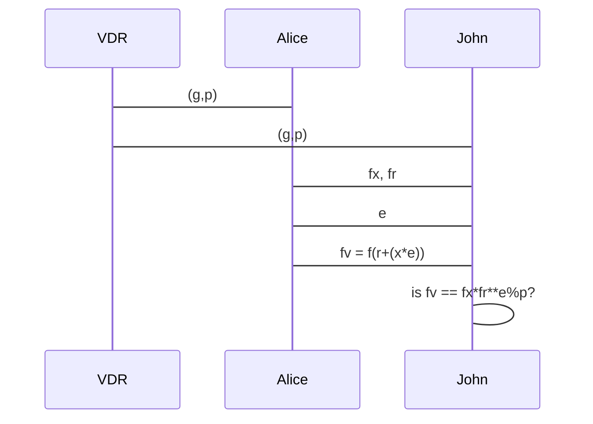

# Preuve à divulgation nulle de connaissance

> Une preuve à divulgation nulle de connaissance (Zero Knowledge Interactive proof ou ZKIP en anglais) est un protocole cryptographique permettant l'authentification sécurisée d'informations. Dans le cadre de ce protocole, une entité, nommée « fournisseur de preuve », prouve mathématiquement à une autre entité, le « vérificateur », qu'une proposition est vraie sans révéler d'autres informations que la véracité de la proposition.

---

# Lois des exposants

​​Produit de puissances de même base: $x^{a}*x^{b}=x^{a+b}$

​Puissance d'une puissance: $(x^a)^b = x^{a*b}$

```python
>>> (x, a, b) = (10, 2, 3)
>>> x**a * x**b == x**(a+b)
True
>>> (x**a)**b == x**(a*b)
True
```

---

# Modulo (opération)

En informatique, l'opération modulo est une opération binaire qui associe, à deux entiers naturels, le reste de la division euclidienne du premier par le second.

```python
>>> 9 % 3
0
>>> 9 % 4
1
```
---

# Fonction non-réversible

cette fonction est non-réversible:

$f(x) = g^{x} \mod p$

ce qui signifie que même si on connait g et p et f(x), il est difficile de retrouver x

en Python:

```python
>>> (g, p) = (101, 11)
>>> f = lambda x: g ** x % p
>>> [f(x) for x in range(0,100)]
[1, 2, 4, 8, 5, 10, 9, 7, 3, 6, 1, 2, 4, 8, 5, 10, 9, 7, 3, 6, 1, 2, 4, 8, 5, 10, 9, 7, 3, 6, 1, 2, 4, 8, 5, 10, 9, 7, 3, 6, 1, 2, 4, 8, 5, 10, 9, 7, 3, 6, 1, 2, 4, 8, 5, 10, 9, 7, 3, 6, 1, 2, 4, 8, 5, 10, 9, 7, 3, 6, 1, 2, 4, 8, 5, 10, 9, 7, 3, 6, 1, 2, 4, 8, 5, 10, 9, 7, 3, 6, 1, 2, 4, 8, 5, 10, 9, 7, 3, 6]
>>> (g, p) = (101, 11)
>>> x = 13
>>> r = 23
>>> e = 42
>>> fx = f(x)
>>> fr = f(r)
>>> fv = f(r+(x*e))
>>> fv == fx*fr**e%p
True
```

---
dragPos:
  square: 641,6,167,_,-16
---

# Diagramme de séquence


