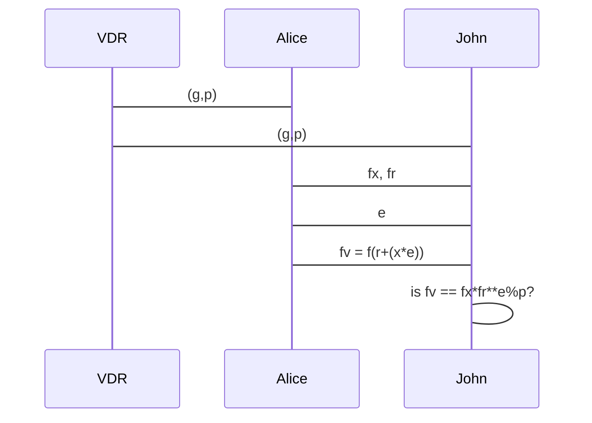

---
# You can also start simply with 'default'
theme: seriph
# random image from a curated Unsplash collection by Anthony
# like them? see https://unsplash.com/collections/94734566/slidev
background: https://photos.fife.usercontent.google.com/pw/AP1GczOMK8tph5hFbSTOi14XOA6VIoueXuCD6OKqXNu4QWNxLs_rtec02qA94g=w1771-h1328-s-no-gm?authuser=0
# some information about your slides (markdown enabled)
title: Introduction à l'identité numérique décentralisée
info: |
## Presentation
# apply unocss classes to the current slide
class: text-center
# https://sli.dev/features/drawing
drawings:
  persist: false
# slide transition: https://sli.dev/guide/animations.html#slide-transitions
transition: slide-left
# enable MDC Syntax: https://sli.dev/features/mdc
mdc: true
# take snapshot for each slide in the overview
overviewSnapshots: true
---
# Introduction à l'identité numérique décentralisée
---
---
# Ricky Ng-Adam (ricky@coderbunker.ca)

https://www.linkedin.com/in/rngadam/

<Transform :scale="0.4">

</Transform>

---
class: center
---
<Transform :scale="0.6">

</Transform>
---
---

# Agenda

* Qu'est-ce que l'identité numérique décentralisée?
* Qu'est-ce qu'un justificatif numérique?
* Comment fonctionne la preuve à divulgation nulle de connaissance?
* Quelles sont les composantes d'un système d'identité numérique décentralisée?

---

# Introduction à l'identité numérique décentralisée

L’identité numérique décentralisée est une approche innovante qui permet aux individus de contrôler directement leur propre identité numérique. Contrairement aux systèmes centralisés traditionnels, où les informations d’identité sont gérées par des entités tierces, l’identité décentralisée repose sur des technologies comme la blockchain pour offrir une gestion plus sécurisée et privée des données personnelles.

Dans cette présentation de 20 minutes, les concepts de base de l'identité décentralisée seront introduits ainsi que leurs applications autour de l'agent Python Aries de Hyperledger (transféré à l'OpenWallet Foundation)

<!--
The last comment block of each slide will be treated as slide notes. It will be visible and editable in Presenter Mode along with the slide. [Read more in the docs](https://sli.dev/guide/syntax.html#notes)
-->

---
transition: fade-out
---

# Qu'est-ce que l'identité numérique décentralisée?

Les caractéristiques de l'identité numérique décentralisée:

- 🛡️**Contrôle utilisateur** - Les utilisateurs gèrent eux-mêmes leurs identifiants et informations personnelles, stockées dans un portefeuille numérique sécurisé
- 🔒 **Confidentialité et Sécurité** -  Les données ne sont pas stockées sur un serveur centralisé mais sur un portefeuille numérique local
- 🔄 **Interopérabilité** - Utilisation de normes ouvertes pour assurer que les identifiants peuvent être vérifiés et utilisés à travers différentes plateformes et services
- ✅ **Émission et Vérification** - Les identifiants sont émis par des entités de confiance (comme des gouvernements ou des institutions éducatives) et peuvent être vérifiés par n’importe quel service nécessitant une authentification
- 🌐 **Portabilité** - Les utilisateurs peuvent transporter et utiliser leurs identifiants numériques partout où ils en ont besoin, sans dépendre d’une seule entité
<br>
<br>

Lire plus [Decentralized Identity Foundation](https://identity.foundation/)

<!--
You can have `style` tag in markdown to override the style for the current page.
Learn more: https://sli.dev/features/slide-scope-style
-->

<style>
h1 {
  background-color: #2B90B6;
  background-image: linear-gradient(45deg, #4EC5D4 10%, #146b8c 20%);
  background-size: 100%;
  -webkit-background-clip: text;
  -moz-background-clip: text;
  -webkit-text-fill-color: transparent;
  -moz-text-fill-color: transparent;
}
</style>

<!--
Here is another comment.
-->
---
---
# Justificatifs numériques (aka Identifiants vérifiables)

Triangle de confiance entre émetteur, détenteur et vérificateur


---
---

# Composantes d'un système d'identités décentralisées

* Identifiants décentralisés (W3C DID)
* Verifiable Data Registry (Hyperledger Indy)
* Attestations vérifiables (cryptographie anoncreds-rs)
* Protocoles de communication (DIDcomm)
* Agents (acapy)
* Contrôleurs (logique d'affaires - intégration avec les organisations émettrices)
* Portefeuilles numérique (interface utilisateur, génération et stockage)

---
---
# Preuve à divulgation nulle de connaissance

<AutoFitText :max="60" :min="30">
Une preuve à divulgation nulle de connaissance (Zero Knowledge Interactive proof ou ZKIP en anglais) est un protocole cryptographique permettant l'authentification sécurisée d'informations. Dans le cadre de ce protocole, une entité, nommée « fournisseur de preuve », prouve mathématiquement à une autre entité, le « vérificateur », qu'une proposition est vraie sans révéler d'autres informations que la véracité de la proposition.
</AutoFitText>

---
---
# Sésame

Jean-Jacques Quisquater: "How to Explain Zero-Knowledge Protocols to Your Children"

Peggy choisi A ou B au hasard


---
---
# Mise au défi par Victor

Victor test A ou B au hasard


---
---
# Preuve de Peggy

Peggy sort correctement de A ou B


---
---

# Lois des exposants

Quelques lois mathématiques simples

​​Produit de puissances de même base: $x^{a}*x^{b}=x^{a+b}$

​Puissance d'une puissance: $(x^a)^b = x^{a*b}$

```python
>>> (x, a, b) = (10, 2, 3)
>>> x**a * x**b == x**(a+b)
True
>>> (x**a)**b == x**(a*b)
True
```

---

# Modulo (opération)

En informatique, l'opération modulo est une opération binaire qui associe, à deux entiers naturels, le reste de la division euclidienne du premier par le second.

```python
>>> 9 % 3
0
>>> 9 % 4
1
```
---

# Fonction non-réversible

cette fonction est non-réversible:

$f(x) = g^{x} \mod p$

ce qui signifie que même si on connait g et p et f(x), il est difficile de retrouver x

en Python:

```python
>>> (g, p) = (101, 11)
>>> f = lambda x: g ** x % p
>>> [f(x) for x in range(0,100)]
[1, 2, 4, 8, 5, 10, 9, 7, 3, 6, 1, 2, 4, 8, 5, 10, 9, 7, 3, 6, 1, 2, 4, 8, 5, 10, 9, 7, 3, 6, 1, 2, 4, 8, 5, 10, 9, 7, 3, 6, 1, 2, 4, 8, 5, 10, 9, 7, 3, 6, 1, 2, 4, 8, 5, 10, 9, 7, 3, 6, 1, 2, 4, 8, 5, 10, 9, 7, 3, 6, 1, 2, 4, 8, 5, 10, 9, 7, 3, 6, 1, 2, 4, 8, 5, 10, 9, 7, 3, 6, 1, 2, 4, 8, 5, 10, 9, 7, 3, 6]
>>> (x, r) = (13, 42)
>>> e = 42
>>> fx = f(x)
>>> fr = f(r)
>>> fv = f(r+(x*e))
>>> fv == fx*fr**e%p
True
```

---
dragPos:
  square: 641,6,167,_,-16
---

# Diagramme de séquence



---
---
# AnonCreds Specification (hyperledger/anoncreds-rs)
La spécification AnonCreds (Anonymous Credentials) est basée sur l'implémentation open source des informations d'identification vérifiables d'AnonCreds qui est utilisée depuis 2017, initialement dans le cadre du projet open source Hyperledger Indy et désormais dans le projet Hyperledger AnonCreds. L'utilisation intensive d'AnonCreds dans le monde entier en a fait une norme de facto pour les informations d'identification vérifiables basées sur ZKP, et cette spécification est la formalisation de cette implémentation.


---
---
# Verifiable Data Registry (VDR)

Hyperledger Indy: une chaîne de blocs avec permissions

<Transform  :scale="0.9">

</Transform>


---
---
# ACA-py (aka acapy aka hyperledger/aries-cloudagent-python)

ACA-Py est une base pour la création d'écosystèmes de justificatifs vérifiables (VC). Il fonctionne dans les deuxième et troisième couches du cadre Trust Over IP (PDF) en utilisant une variété de formats et de protocoles de justificatifs vérifiables. ACA-Py s'exécute sur des serveurs (cloud, entreprise, appareils IoT, etc.) et n'est pas conçu pour fonctionner sur des appareils mobiles.

migré il y a quelques jours de hyperledger/aries-cloudagent-python à openwallet-foundation/acapy


---
---
# Architecture de ACA-py

<div class="flex w-full">
  <span style="flex-grow: 1;">
    
  </span>
  <span>
    
  </span>
</div>

---
---
# Credo (openwallet-foundation/credo-ts)

Credo est un cadriciel écrit en TypeScript pour la création de solutions d'identité décentralisées.

Credo est indépendant de tout protocole d'échange spécifique, format d'informations d'identification, suite de signatures ou méthode DID, mais se concentre actuellement principalement sur l'alignement avec OpenID4VC, DIDComm et Hyperledger Aries.

<Transform  :scale="0.5">

</Transform>

---
---
# Bifold Wallet (openwallet-foundation/bifold-wallet/)

* Bifold Wallet est un projet open source conçu pour améliorer la façon dont nous interagissons avec les identités numériques, en rendant le processus à la fois sécurisé et convivial.
* Il est basé sur React Native, ce qui lui permet de fonctionner sans problème sur différents appareils et plateformes, tels qu'iOS et Android.
* Il s'agit d'un exemple majeur de portefeuille numérique, qui vise à rendre les informations d'identification vérifiables (VC) simples et pratiques pour tous.

---
---
# Conclusion et période de questions

Justificatifs et attestations numériques de sources fiables avec le partage d'information géré par le détenteur (le citoyen)!

---
---
# Pour en apprendre plus

* https://www.w3.org/TR/did-core/
* https://dev.uniresolver.io/
* https://github.com/decentralized-identity/universal-resolver
* https://github.com/rngadam/zkp-exemple
* https://github.com/hyperledger/anoncreds-rs
* https://github.com/hyperledger/indy-node
* https://github.com/bcgov/von-network
* https://aca-py.org/latest/
* https://github.com/openwallet-foundation/acapy
* https://github.com/openwallet-foundation/credo-ts
* https://github.com/openwallet-foundation/bifold-wallet/
* https://github.com/openwallet-foundation/acapy-vc-authn-oidc

---
---
# gouvernements

* https://www.quebec.ca/gouvernement/identite-numerique/programme-service-quebecois-identite-numerique
* https://www.ontario.ca/fr/page/identite-numerique-ontarienne
* https://www.canada.ca/fr/gouvernement/systeme/gouvernement-numerique/innovations-gouvernementales-numeriques/justificatifs-numeriques.html
* https://digital.gov.bc.ca/digital-trust/home/
* https://digital.gov.bc.ca/digital-trust/showcase/

---
---
# formation

* https://training.linuxfoundation.org/training/introduction-to-hyperledger-sovereign-identity-blockchain-solutions-indy-aries-and-ursa/#
* https://training.linuxfoundation.org/training/becoming-a-hyperledger-aries-developer-lfs173/


<PoweredBySlidev mt-10 />
